# Voice Live API — Minimal Sample

A bare-bones voice assistant that connects a browser (or any WebSocket client) to
**Azure Voice Live API** using the official
[`azure-ai-voicelive`](https://pypi.org/project/azure-ai-voicelive/) Python SDK.

## What it does

```
Browser Mic ──PCM16──▶ Quart Server ──SDK──▶ Azure Voice Live (GPT model)
Browser Spkr ◀──PCM16── Quart Server ◀──SDK── Azure Voice Live (GPT model)
```

1. User clicks **Start Talking** in the browser.
2. Audio streams over a WebSocket to the Python server.
3. The server relays it to Azure Voice Live, which runs a GPT realtime model.
4. The model's spoken response streams back to the browser in real time.
5. Two dummy tools (`get_stock_price`, `get_weather`) demonstrate function calling.

## Architecture

```mermaid
graph LR
    subgraph Client ["🖥️ Client (Browser / iOS)"]
        MIC["🎤 Microphone"]
        SPK["🔊 Speaker"]
    end

    subgraph Server ["🐍 Python Server (Quart)"]
        WS["WebSocket\n/ws"]
        AGENT["VoiceLiveAgent"]
        TOOLS["Tools\nget_stock_price\nget_weather"]
    end

    subgraph Azure ["☁️ Azure AI Services"]
        VL["Voice Live API\n(GPT Realtime Model)"]
    end

    MIC -- "PCM16 audio\n(binary frames)" --> WS
    WS -- raw bytes --> AGENT
    AGENT -- "SDK\n(base64 audio)" --> VL
    VL -- "audio + events" --> AGENT
    AGENT -- "PCM16 audio\n(binary frames)" --> WS
    WS --> SPK
    VL -. "tool call" .-> AGENT
    AGENT -. "execute" .-> TOOLS
    TOOLS -. "result" .-> AGENT
    AGENT -. "tool output" .-> VL
```



## Prerequisites

| Requirement | Details |
|---|---|
| Python | 3.9 or later |
| Azure AI Services | A resource with **Voice Live** enabled |
| API key | From the Azure portal → Keys and Endpoint |

## Quick start

```bash
# 1. Clone the repo and create a virtual environment
git clone <repo-url>
cd Voice_Agent_Plain_Svc
python -m venv .venv
.venv\Scripts\activate      # Windows
# source .venv/bin/activate  # macOS / Linux

# 2. Install dependencies
pip install .

# 3. Create your .env file from the example
copy .env.example .env      # Windows
# cp .env.example .env      # macOS / Linux

# 4. Edit .env — fill in your Azure AI Services endpoint and API key
#    (Get these from Azure Portal → your resource → Keys and Endpoint)

# 5. Run the server
python server.py

# 6. Open http://localhost:8000 in your browser and click "Start Talking"
```

## Project structure

```
├── server.py              Quart web server — serves frontend & WebSocket endpoint
├── voice_agent.py         Voice Live session manager (SDK connect, events, tools)
├── tools.py               Tool definitions + dummy handlers (stock price, weather)
├── pyproject.toml         Python package metadata & dependencies
├── .env.example           Template — copy to .env and add your credentials
├── .env                   Your Azure credentials (git-ignored, you create this)
└── frontend/
    ├── index.html         Single-page UI with one button
    ├── index.js           WebSocket client, mic capture, audio playback
    ├── index.css           Minimal styling
    ├── audio-processor.js  AudioWorklet — speaker ring-buffer playback
    └── mic-processor.js    AudioWorklet — microphone capture buffering
```

## WebSocket protocol

The `/ws` endpoint uses a simple, client-agnostic protocol designed to work with
browsers *and* native mobile apps (e.g. a future iOS client):

| Direction | Frame type | Content |
|---|---|---|
| Client → Server | binary | Raw PCM16-LE audio, 24 kHz, mono |
| Server → Client | binary | Raw PCM16-LE audio, 24 kHz, mono |
| Server → Client | text | JSON: `{"type":"transcript","role":"assistant","text":"..."}` |
| Server → Client | text | JSON: `{"type":"transcript","role":"user","text":"..."}` |
| Server → Client | text | JSON: `{"type":"speech_started"}` (barge-in signal) |
| Server → Client | text | JSON: `{"type":"call_state","state":"ended"}` |

### iOS integration notes

An iOS app can connect to `wss://<host>/ws` using `URLSessionWebSocketTask` and
send PCM16 frames captured from `AVAudioEngine` (set the output format to
`AVAudioFormat(commonFormat: .pcmFormatInt16, sampleRate: 24000, channels: 1,
interleaved: true)`). Received binary frames are the same format and can be played
via `AVAudioPlayerNode`.

## How tools work

Tools are defined in `tools.py`. Each tool has:
1. A **`FunctionTool` schema** — tells the GPT model when and how to call it.
2. A **handler function** — runs locally when the model decides to invoke it.

To add a new tool, add a `FunctionTool(...)` to `TOOL_DEFINITIONS` and a matching
handler to `TOOL_HANDLERS`. The voice agent picks them up automatically.

## Adding a new tool — example

```python
# In tools.py

def lookup_order(arguments: dict) -> str:
    order_id = arguments.get("order_id", "")
    return json.dumps({"order_id": order_id, "status": "shipped", "eta": "tomorrow"})

TOOL_DEFINITIONS.append(
    FunctionTool(
        name="lookup_order",
        description="Look up the status of a customer order",
        parameters={
            "type": "object",
            "properties": {
                "order_id": {"type": "string", "description": "The order ID to look up"}
            },
            "required": ["order_id"],
        },
    )
)

TOOL_HANDLERS["lookup_order"] = lookup_order
```
